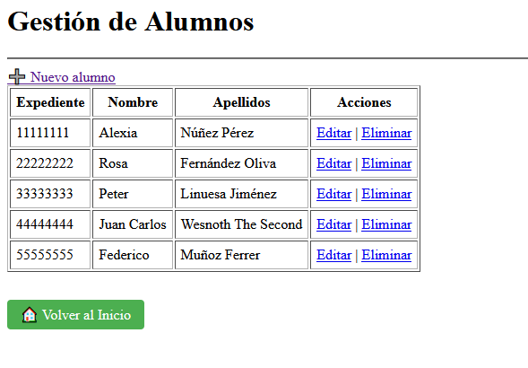
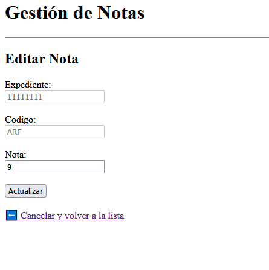

# Dark Academy - Gestión Académica

Sistema de gestión académico para Dark Academy, construido con Python, Flask y MySQL.

## 📋 Características

- **Autenticación segura**: Login y registro con hash de contraseñas (Werkzeug)
- **Gestión de alumnos**: CRUD completo de estudiantes
- **Gestión de módulos**: CRUD de asignaturas
- **Gestión de notas**: CRUD de calificaciones
- **Auditoría de notas**: Triggers que registran todos los cambios en las notas
- **Seguridad de sesiones**: Sesiones con tiempo de expiración y cookies seguras

## 📸 Capturas

  
*Gestión de alumnos*

  
*Editar nota*

## 🛠️ Tecnologías

- **Backend**: Python 3 + Flask
- **Base de datos**: MySQL
- **Plantillas**: Jinja2
- **Seguridad**: Werkzeug (hash de contraseñas)

## 🚀 Instalación y Configuración

### 1. Clonar el repositorio
```bash
git clone https://github.com/Azamiku/dark-academy-student-manager.git
cd dark-academy-student-manager
```

### 2. Instalar dependencias
```bash
pip install flask mysql-connector-python werkzeug
```

### 3. Configurar la base de datos

1. Crea la base de datos ejecutando el script `dark.sql` en tu servidor MySQL:
```bash
mysql -u root -p < dark.sql
```

2. Copia el archivo de configuración de ejemplo:
```bash
cp config.py.example config.py
```

3. Edita `config.py` con tus credenciales de MySQL:
```python
config = {
    'user': 'tu_usuario',
    'password': 'tu_contraseña',
    'database': 'Dark_Academy',
    'host': 'localhost'
}
```

### 4. Ejecutar la aplicación
```bash
python app_web_plantilla.py
```

La aplicación estará disponible en: `http://localhost:5000`

## 📊 Estructura de la Base de Datos

La base de datos `Dark_Academy` contiene las siguientes tablas:

- **`usuarios`**: Usuarios del sistema (para login)
- **`alumnos`**: Información de los estudiantes
- **`modulos`**: Asignaturas del curso
- **`notas`**: Calificaciones de los alumnos
- **`auditoria_notas`**: Registro de cambios en las notas (triggers)

## 🎯 Funcionalidades Principales

### Seguridad
- Hash de contraseñas con Werkzeug
- Sesiones con tiempo de expiración (30 minutos)
- Protección de rutas con decorador `@login_required`
- Bloqueo después de 5 intentos fallidos de login

### CRUD
- **Alumnos**: Listar, crear, editar y eliminar estudiantes
- **Módulos**: Listar, crear, editar y eliminar asignaturas
- **Notas**: Listar, crear, editar y eliminar calificaciones

### Base de Datos Avanzada
- Triggers de auditoría para INSERT, UPDATE y DELETE en notas
- Función `expediente_correcto()` para validar formatos de expediente
- Trigger `alumnos_check_bi` para validar expedientes antes de insertar
- Procedimiento almacenado `pasan_segundo()` para calcular alumnos que pasan de curso

## 📁 Estructura del Proyecto

```
dark-academy-student-manager/
├── app_web_plantilla.py      # Aplicación Flask principal
├── config.py.example          # Ejemplo de configuración
├── conectar_logger.py         # Módulo de conexión a MySQL
├── DA_plantilla_alumnos.py    # Script de inicialización
├── dark.sql                   # Script de la base de datos
├── templates/                 # Plantillas HTML
│   ├── login.html
│   ├── registro.html
│   ├── inicio.html
│   ├── alumnos*.html
│   ├── modulos*.html
│   └── notas*.html
└── .gitignore                 # Archivos ignorados por Git
```

## 👨‍💻 Contexto académico

Proyecto del módulo de **Acesso a Datos** — DAM (Desarrollo de Aplicaciones Multiplataforma).

## 📝 Nota

Este proyecto tiene una temática fantástica ("Dark Academy", "Artes Oscuras") como parte de un proyecto académico. Es una demostración técnica de CRUD, seguridad y gestión de bases de datos.
